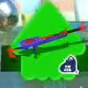
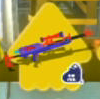
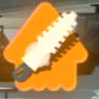
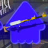

# 先頭5frame集約で残った誤判定

画像は使用した先頭frame。予測は5frame集約。画像を見て正解ラベルやモデルを変更していません。

チャージャー／スコープ系3件、Orderブラシ／ワイパー系2件。高confidenceの誤りもあり、scoreだけによる自動確定には注意が必要です。
原因は未確定で、見た目の近さ・少数データ・cropでの細部欠落を切り分けるには追加の独立試合が必要です。

## 1. スプラチャージャーコラボ → .96ガロン爪

match `19ac1c550cd7d3f5849a3836_000613800` / left0 / score 0.0728 / margin 0.0058

[context frame](errors/01_context.jpg)

## 2. スプラスコープコラボ → スプラチャージャーコラボ

match `bdaa17824cb04961_000026305_280a9a` / right1 / score 0.8647 / margin 0.8434

[context frame](errors/02_context.jpg)

## 3. オーダーブラシ レプリカ → オーダーワイパー レプリカ

match `da92b28605fd4aef_001348081_ba33ae` / left3 / score 0.7922 / margin 0.7755

[context frame](errors/03_context.jpg)

## 4. オーダーワイパー レプリカ → オーダーブラシ レプリカ

match `da92b28605fd4aef_001474766_32674f` / right3 / score 0.5670 / margin 0.5232

[context frame](errors/04_context.jpg)

## 5. スプラチャージャー → スプラスコープ

match `e9ef5b0321984e59_000156837_d20ceb` / left1 / score 0.2853 / margin 0.1871

[context frame](errors/05_context.jpg)

